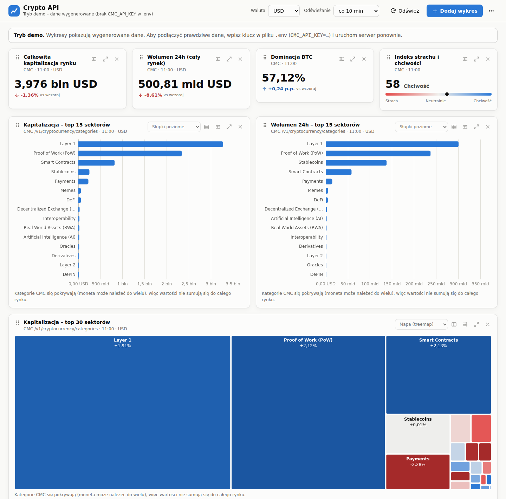

# Crypto API – dashboard kryptowalut

Konfigurowalny dashboard oparty o [CoinMarketCap API](https://coinmarketcap.com/api/).
Wykresy dodajesz przez wyszukiwarkę podzieloną na kategorie danych, które udostępnia API
(rynek globalny, sektory, kryptowaluty, sentyment, historia, konto). Układ zapisuje się automatycznie.



## Co jest w środku

- **Startowy układ**: kapitalizacja i wolumen całego rynku, dominacja BTC, indeks strachu i chciwości,
  kapitalizacja i wolumen **sektorów (branż)**, mapa sektorów, wolumen wg segmentów rynku, top wolumen monet
  i siła względna sektorów w czasie.
- **Wyszukiwarka wykresów** (przycisk *Dodaj wykres* albo klawisz `/`):
  - pole tekstowe z podpowiedziami: wpisz `AI`, `DeFi`, `solana`, `wolumen`, `fear`…;
  - lewy panel z **kategoriami danych** odpowiadającymi sekcjom CoinMarketCap API, z liczbą wykresów
    i endpointem, z którego pochodzą;
  - przy każdym wyniku: typ wykresu, endpoint i informacja, czy działa na **darmowym planie**;
  - wpisanie nazwy sektora albo monety tworzy gotowe wykresy dla niej (np. *Sektor AI: top monety*,
    *Solana (SOL): zmiany ceny 1h–90d*).
- **Konfigurator z podglądem na żywo**: miara, liczba pozycji, kolejność, wybór sektorów/monet, typ wykresu,
  rozmiar karty, własny tytuł.
- **Karty**: zmiana typu wykresu, widok tabeli, ustawienia, 3 rozmiary, przeciąganie za uchwyt, usuwanie z cofnięciem.
- **Filtry całego dashboardu**: waluta (USD / EUR / PLN) i automatyczne odświeżanie.
- Motyw jasny / ciemny / automatyczny, układ działa też na telefonie.
- Eksport i import układu (JSON), przywracanie domyślnego.

## Szybki start

Wymagany Node.js 20.12 lub nowszy.

```bash
git clone https://github.com/<twoj-login>/crypto-api.git
cd crypto-api
npm install
cp .env.example .env        # Windows: copy .env.example .env
```

Otwórz `.env` i wklej swój klucz:

```
CMC_API_KEY=twoj-klucz-z-coinmarketcap
```

Uruchom:

```bash
npm start
```

i wejdź na <http://localhost:3000>.

**Tryb demo** (bez klucza, dane wygenerowane – do obejrzenia interfejsu): `npm run demo`.
Serwer sam przechodzi w tryb demo, gdy w `.env` nie ma klucza.

> Klucz API jest używany wyłącznie przez serwer (przeglądarka go nie widzi), a plik `.env` jest w `.gitignore`,
> więc nie trafi do repozytorium. CoinMarketCap i tak nie pozwala wołać API bezpośrednio z przeglądarki (CORS),
> dlatego serwer działa jako pośrednik z cache.

## Kategorie danych w wyszukiwarce

| Kategoria | Endpointy CMC | Plan | Przykładowe wykresy |
|---|---|---|---|
| Rynek globalny | `/v1/global-metrics/quotes/latest` | darmowy | kapitalizacja, wolumen 24h, dominacja BTC/ETH, DeFi, stablecoiny, derywaty, dominacja (pierścień), segmenty rynku |
| Sektory i kategorie | `/v1/cryptocurrency/categories`, `/v1/cryptocurrency/category` | darmowy | kapitalizacja / wolumen / zmiana 24h / obrót / liczba tokenów sektorów, ekosystemy, portfele VC, top monety w sektorze, mapy (treemap) |
| Kryptowaluty | `/v1/cryptocurrency/listings/latest`, `/v2/cryptocurrency/quotes/latest`, `/v1/cryptocurrency/map` | darmowy | top wg kapitalizacji i wolumenu, wzrosty/spadki 24h, wyniki 7d/30d, heatmapa, porównanie monet, zmiany ceny 1h–90d, kafelek z ceną |
| Sentyment | `/v3/fear-and-greed/latest`, `/v3/fear-and-greed/historical` | darmowy | indeks strachu i chciwości teraz i w czasie |
| Historia (lokalne snapshoty) | dane zapisywane przez serwer | darmowy | rynek, sektory i monety w czasie, siła względna (indeks = 100) |
| Historia CMC | `/v1/global-metrics/quotes/historical`, `/v2/cryptocurrency/quotes/historical` | **płatny (Hobbyist+)** | oficjalna historia rynku i notowań monet |
| Konto API | `/v1/key/info` | darmowy | zużycie kredytów i limity |

Kategorie CoinMarketCap są dzielone na: **sektory (branże)**, **ekosystemy** (np. *Solana Ecosystem*),
**portfele funduszy VC** i **inne** (launchpady, regiony). Kategorie się pokrywają – jedna moneta może należeć
do kilku – więc ich kapitalizacje nie sumują się do całego rynku.

Jeśli Twój klucz nie obejmuje jakiegoś endpointu, karta pokaże komunikat CMC, a wyszukiwarka oznaczy
taki wykres jako *niedostępny dla Twojego klucza*.

## Historia na darmowym planie

Darmowy plan CoinMarketCap nie daje danych historycznych. Dlatego serwer co godzinę
(`SNAPSHOT_INTERVAL_MINUTES`) zapisuje zwięzły snapshot rynku w `data/snapshots.jsonl`:
wskaźniki globalne, 150 największych kategorii i 200 największych kryptowalut. Z tych danych rysowane są
wykresy z grupy *Historia (lokalne snapshoty)* – wypełniają się, dopóki serwer działa.
Starsze niż 30 dni snapshoty są przerzedzane do jednego dziennie.

Snapshot na żądanie: menu `⋯` → *Zapisz snapshot teraz*.

## Kredyty API

Darmowy plan (Basic) ma 10 000 kredytów miesięcznie i 30 zapytań na minutę. Żeby się w tym zmieścić:

- wszystkie wykresy korzystają z **wspólnych zapytań** – np. rankingi, heatmapa i wzrosty/spadki liczone są
  z jednej listy top 200 (1 kredyt);
- serwer trzyma odpowiedzi w cache (`CACHE_TTL_MINUTES`, domyślnie 10 min; kategorie 15 min, indeks strachu 1 h,
  lista monet 24 h), więc odświeżanie przeglądarki nie zużywa kredytów;
- snapshot kosztuje ok. 3 kredyty (co godzinę ≈ 2 200 / miesiąc);
- przeliczenie na EUR/PLN to 1 kredyt na godzinę dla każdej waluty.

Orientacyjnie: domyślny dashboard otwarty 8 h dziennie + snapshoty co godzinę ≈ 6–8 tys. kredytów miesięcznie.
Aktualne zużycie widać w stopce i na wykresie *Zużycie kredytów API*. Jeśli potrzebujesz oszczędzać,
zwiększ `CACHE_TTL_MINUTES` albo `SNAPSHOT_INTERVAL_MINUTES`.

## Konfiguracja (`.env`)

| Zmienna | Domyślnie | Opis |
|---|---|---|
| `CMC_API_KEY` | – | klucz z <https://pro.coinmarketcap.com/account> |
| `PORT` | `3000` | port serwera |
| `HOST` | `127.0.0.1` | adres nasłuchu; `0.0.0.0` udostępnia dashboard w sieci lokalnej |
| `CACHE_TTL_MINUTES` | `10` | cache szybko zmieniających się danych |
| `SNAPSHOT_INTERVAL_MINUTES` | `60` | co ile minut zapisywać snapshot (0 = wyłączone) |
| `SNAPSHOT_RETENTION_DAYS` | `365` | ile dni historii trzymać |
| `CMC_MOCK` | `0` | `1` = tryb demo |
| `DATA_DIR` | `./data` | gdzie zapisywać snapshoty i układ dashboardu |

> Serwer wykonuje zapytania Twoim kluczem, więc nie wystawiaj go publicznie w internecie bez dodatkowego
> zabezpieczenia (np. hasła na reverse proxy) – każdy odwiedzający zużywałby Twoje kredyty.

## Struktura projektu

```
server/
  index.js      serwer HTTP (Express) i API dla przeglądarki
  catalog.js    katalog wykresów: kategorie danych, parametry, presety, przekształcanie danych
  sources.js    wszystkie zapytania do CoinMarketCap w jednym miejscu (parametry + czas cache)
  cmc.js        klient CMC: cache, łączenie równoległych zapytań, komunikaty błędów, licznik kredytów
  history.js    lokalne snapshoty rynku (JSON Lines)
  dashboard.js  układ startowy
  mock.js       dane dla trybu demo w formacie odpowiedzi CMC
public/
  index.html, css/app.css
  js/app.js     siatka kart, zapisywanie układu, filtry, menu
  js/search.js  wyszukiwarka i konfigurator
  js/charts.js  rysowanie wykresów (ECharts), kafelki, tabele
test/           testy (npm test)
```

### Jak dodać nowy typ wykresu

Dopisz obiekt do tablicy `DATASETS` w `server/catalog.js`: `id`, `group` (kategoria w wyszukiwarce),
`endpoint`, `params` (formularz konfiguratora buduje się z nich automatycznie), `charts` (dozwolone typy),
`presets` (pozycje widoczne w wyszukiwarce) i funkcję `load(params)`, która zwraca dane w jednym z formatów:
`categorical` (wiersze), `timeseries` (serie w czasie), `kpi`, `gauge` albo `meters`.
Nowe zapytanie do CMC dodaj w `server/sources.js`, a odpowiedź dla trybu demo w `server/mock.js`.

## Testy

```bash
npm test
```

Testy uruchamiają każdy preset z katalogu na danych demo i sprawdzają walidację parametrów,
przeliczanie walut, wyszukiwanie monet i zapis snapshotów.
